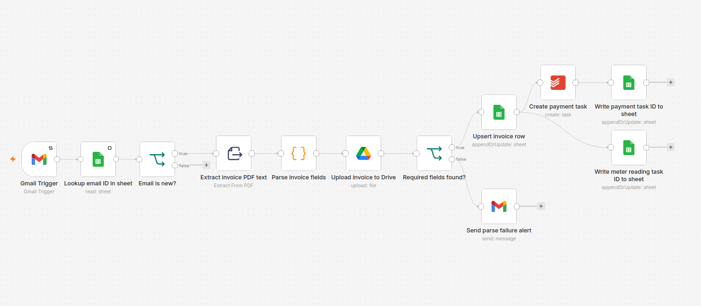

# Utility Billing Reminders

An automated data pipeline designed to parse incoming utility bills, ensuring
timely payments and significantly reducing the cognitive load of tracking
financial deadlines manually.

n8n automation that turns **Águas do Porto** water-bill emails into archived PDFs, a spreadsheet log, and Todoist deadlines — so payments and meter readings are harder to miss.

## Problem

Utility invoices arrive as PDF attachments. Tracking due dates and meter-reading windows by hand is easy to drop: duplicates get processed twice, the PDF lives only in Gmail, and a failed parse leaves no clear next step.

## Solution

A single n8n workflow watches Gmail, deduplicates by message ID, parses the PDF, uploads the invoice to Google Drive, logs the row in Google Sheets, and creates Todoist tasks for **payment** and **meter reading**. If required fields fail to parse, it emails an alert with a link to the saved file.



## Results

- **No lost bills** — each new invoice becomes a Drive file plus Sheet row
- **No duplicate tasks** — early dedupe by Gmail **Email ID** before PDF work
- **Actionable deadlines** — Todoist payment task (due date from the invoice) and meter-reading task (due at the end of the reading window when parsed)
- **Safe failure** — parse errors alert with a **Drive** link, without writing Sheet/Todoist noise

## Pipeline

```
Gmail Trigger
  → Lookup email ID in sheet
  → Email is new?
       ├─ false → stop (already processed)
       └─ true  → Extract invoice PDF text
                    → Parse invoice fields
                    → Upload invoice to Drive
                    → Required fields found?
                         ├─ true  → Upsert invoice row (incl. Invoice link)
                         │            ├─ Create payment task → Write payment task ID
                         │            └─ Create meter reading task → Write meter reading task ID
                         └─ false → Send parse failure alert (Drive file link)
```

## How it works

### Input

- **Source:** Gmail Trigger (poll ~daily)
- **Filters:** sender `noreply@aguasdoporto.pt`, unread, `has:attachment`
- **Payload:** PDF attachment → text extraction

### Deduplication

Before extract/parse, the workflow looks up the Gmail **Email ID** in Google Sheets. If it already exists → stop. Otherwise → continue.

### Parsing

| Field | Invoice cue |
| --- | --- |
| Invoice Date | `Emissão` (fallback: Gmail message date → `YYYY-MM-DD`) |
| Billing Period | `Período Faturação` |
| Amount | `Valor a Pagar` |
| Due Date | `Pagar até` |
| Billing Month | derived from period start (e.g. `May`) |
| Meter Reading Window | `Período de Comunicação` |

Missing values become `"Not found"`. **Billing Period**, **Amount**, or **Due Date** missing → fail path. A missing meter window does **not** fail the run (meter task is still created, without a due date).

### Output

| Path | What happens |
| --- | --- |
| **Always** (new email) | PDF uploaded as `water {{Invoice Date}}.pdf` |
| **Success** | Sheet upsert (incl. Invoice link); payment + meter Todoist tasks; task IDs written back |
| **Fail** | Alert email with Drive file link; no Sheet row, no Todoist tasks |

Payment task description includes billing period and the Drive invoice link. Meter task due date uses the **end** of the reading window when present.

## Design decisions

- **Dedupe key = Email ID** (not billing period) — stable per message, checked before expensive PDF work
- **Drive via OAuth2** — service accounts are a poor fit for personal My Drive uploads
- **Upload before success/fail split** — both alert and Sheet can link to the same file
- **Payment fields required; meter window optional** — different criticality, different failure behavior

## Stack

- **n8n** — orchestration (Docker)
- **Gmail API** — trigger + parse-failure alerts (OAuth2)
- **Google Drive API** — invoice PDF archive (OAuth2)
- **Google Sheets API** — archive + early dedupe + upsert (service account)
- **Todoist API** — payment and meter-reading deadlines

## Try it

Sanitized workflow export (no credentials or personal resource IDs):

[`workflows/utility-billing.json`](workflows/utility-billing.json)

Import into your own n8n, then attach Gmail / Google Drive OAuth2 / Google Service Account / Todoist credentials and select your Drive folder, Sheet, Todoist project, alert recipient, and meter-reading portal URL.

## Scope & limitations

- **In scope:** Águas do Porto water invoices only
- **Hosting:** local Docker on a laptop (runs when the machine is on); server migrate is optional later
- **Not included:** other utilities, multi-tenant setup, or a public hosted demo
